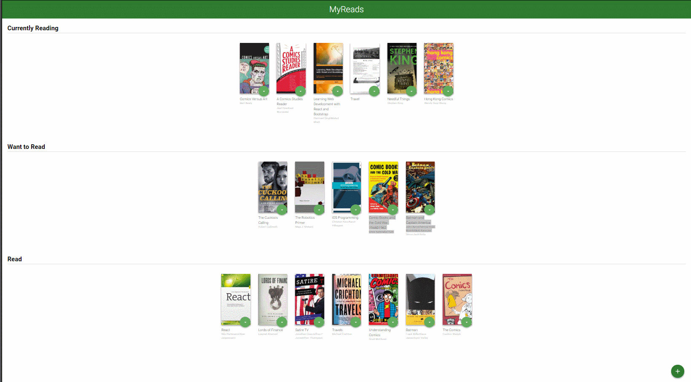

# My-Reads-App
MyReads is a project from Udacity's React Nanodegree course. This is a bookshelf app that lets you to organize books that you have read,want to read or currently reading.

Here is what the app looks like

How to use the app

Home page displays three shelves that are 'cureently reading', 'want to read' and 'read'. User can click on the dropdown menu which is located at bottom right corner of every book to change the current shelf to 'currently reading', 'want to read' or 'read'

If the user clicks on the + button which is located at the bottom right corner of the page, it will take the user to the search page and user can search for more books by "author" or "book" name and can add books to their shelves by clicking on the drop-down menu.

Installation

- To install the application clone this git repository

$ git clone https://github.com/ampreetarsh/reactnd-project-myreads-starter.git myreads

- Go into the application folder

cd myreads

- Install dependencies usingnpm command line tool

$ npm install

- Run the application, again using

$ npm start

This will open a new browser window with the application running.
